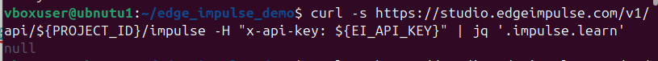
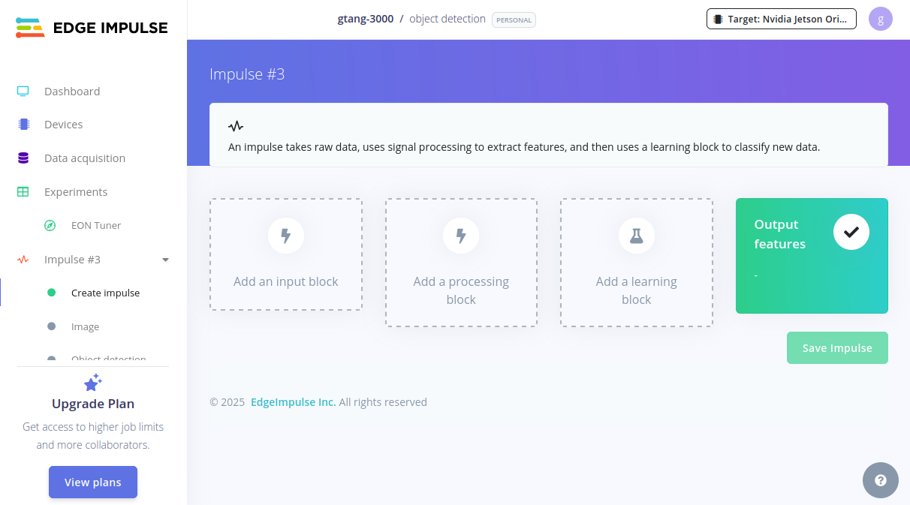
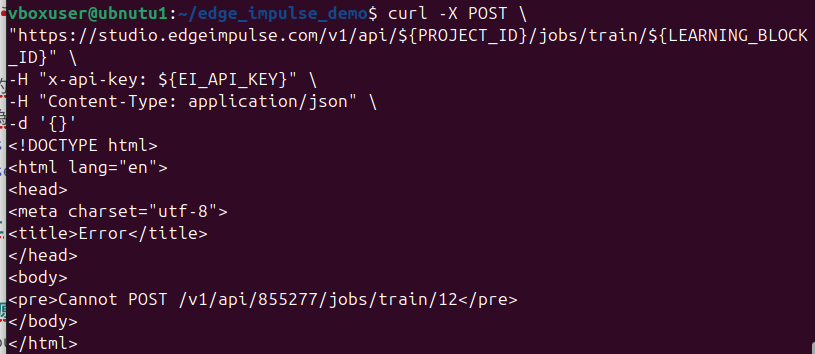
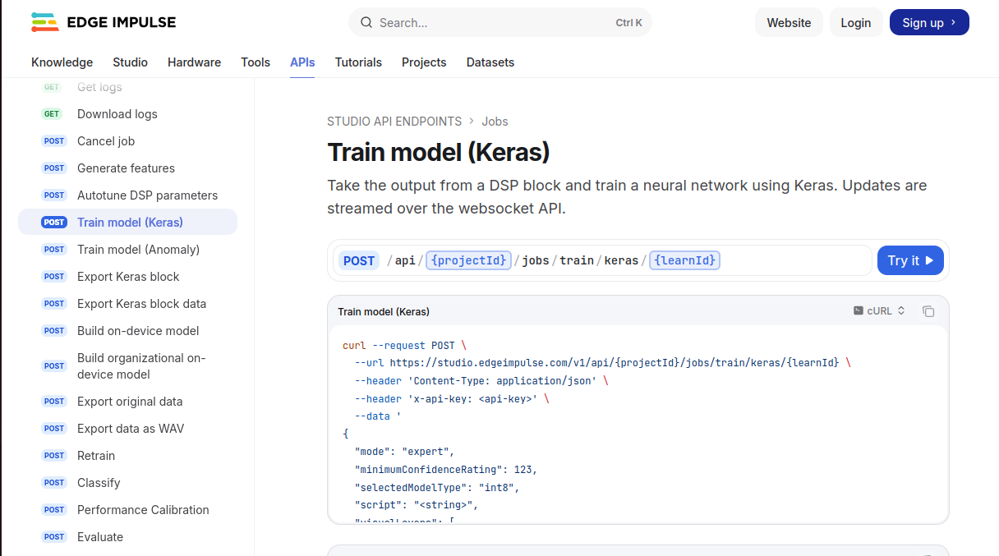

# 錯誤與錯誤處理紀錄
---

## API Returns null


### 問題原因
1.在回應的 JSON 中找不到 .impulse.learn 這個路徑

2.尚未定義 Impulse learnBlocks
### 解決方式
先到網站上查看有沒有設定learning block


輸入 
```
curl -s "https://studio.edgeimpulse.com/v1/api/${PROJECT_ID}/impulse" -H "x-api-key: ${EI_API_KEY}" | jq '.'
```
查看原始 JSON


找到正確的路徑是.impulse.learnBlocks 不是.impulse.learn
修改指令為
```
curl -s "https://studio.edgeimpulse.com/v1/api/${PROJECT_ID}/impulse" -H "x-api-key: ${EI_API_KEY}" | jq '.impulse.learnBlocks'
```
## Cannot POST /jobs/train/${LEARNING_BLOCK_ID}


### 問題原因
URL 路徑不正確
在 Edge Impulse API 中，沒有/jobs/train/${LEARNING_BLOCK_ID}這個端點
### 解決方式
從官方 API 裡面找正確的路徑
https://docs.edgeimpulse.com/apis


## Git Pull Failed (Merge Conflict)


### 問題原因
在 `batch_upload.sh` 檔案中發生合併衝突 (Merge Conflict)。
具體原因為：本地端 (Local) 與最新 fetch 下來的遠端 (Origin) 版本中，在同一個檔案的同一段落或相鄰行數，雙方都有不同的修改內容，導致 Git 無法自動合併。

### 解決方式
1. 如果不在乎原本的檔案（放棄本地修改）：
輸入以下指令，這將會強制使用遠端 `main` 分支的版本覆蓋本地版本：
```bash
git reset --hard origin/main
```
如果需要保留本地修改（手動解決衝突）： 必須依照圖片指示對 batch_upload.sh 進行改動。 請開啟該檔案，搜尋衝突標記（<<<<<<<, =======, >>>>>>>），手動判斷並修改程式碼以解決衝突，完成後再進行 add 與 commit。


