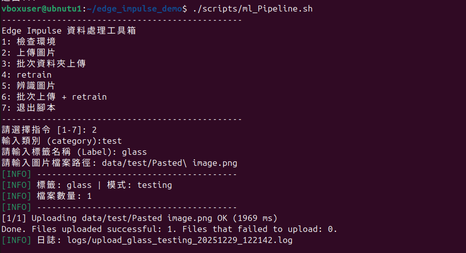
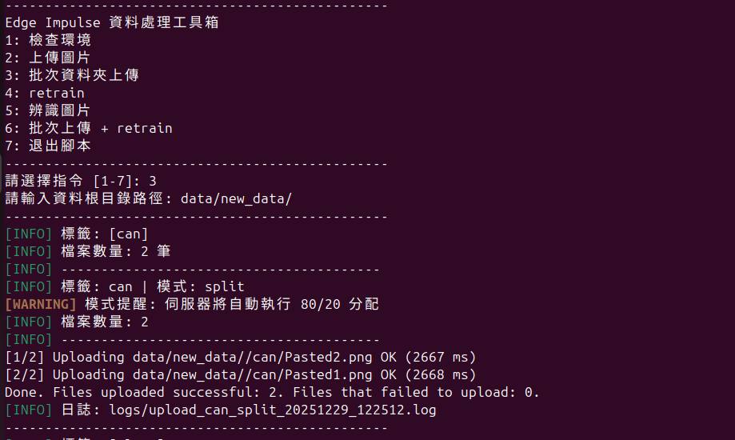
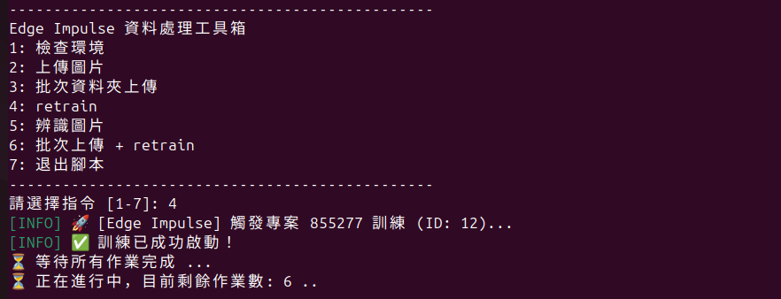
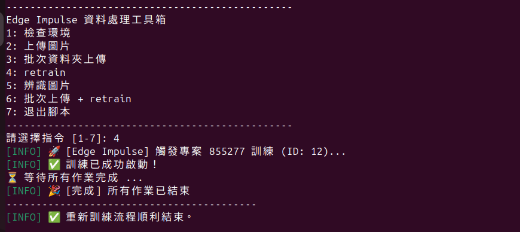
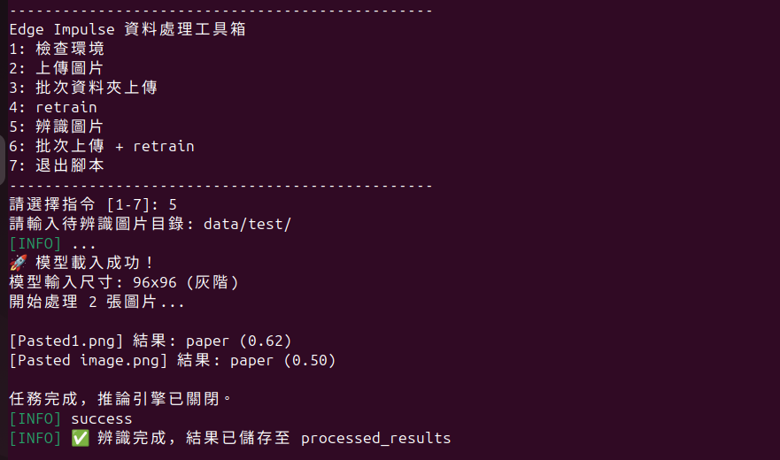

# 使用說明
---
## 檢查環境
### ./scripts/check_env.sh
輸入後直接看結果缺什麼就好了

## 上傳圖片
### ./scripts/upload_data.sh  [選項] <標籤> <圖片路徑 or 資料夾路徑>
選項可不輸入 預設為split 自動將上傳資料分配為8：2
也可輸入 --train 和 --test
範例 ./scripts/upload_data.sh --train coffee coffee.jpg

## 批次資料夾上傳
### ./scripts/batch_upload.sh <圖片資料夾的資料夾路徑>
範例 ./scripts/batch_upload.sh data/new_data/
可以找到data/new_data/底下的資料夾
並以那個資料夾的名字為標籤
上傳資料將以8：2分配

## 重新訓練模型
### ./scripts/retrain.sh
用API重新訓練

## 辨識圖片
### ./scripts/run_inference.sh <圖片路徑>
辨識後會在 processed_results 生成新圖片
圖上會有辨識後的結果

